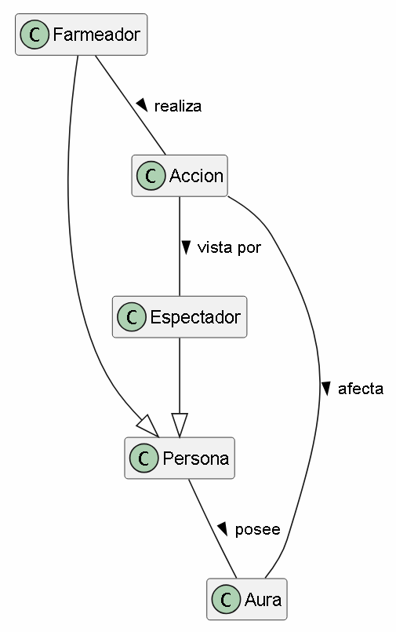
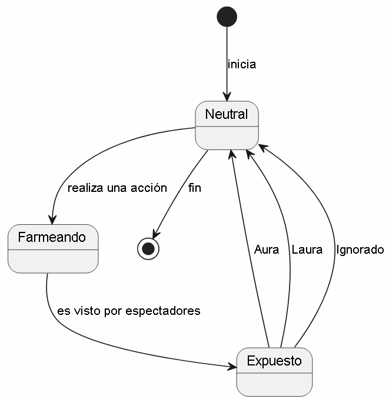

# Farmear aura

## 1. Diagrama de Clases

### Glosario
* **Persona:** Entidad base que participa en el entorno social.
* **Farmeador:** Persona que realiza activamente una acción con el objetivo de ganar estatus.
* **Espectador:** Persona que presencia la acción y actúa como juez del resultado.
* **Accion:** El evento o comportamiento específico realizado por el farmeador (un comentario, un gesto, una hazaña).
* **Aura:** Medida abstracta del prestigio, carisma o "coolness" acumulado por la persona.

### Supuestos Adoptados
* Para que haya una alteración real en el aura, la `Accion` debe contar obligatoriamente con al menos un `Espectador`. El farmeo no existe en el vacío.

### Justificación de Decisiones
* **Herencia y Roles Claros:** Se utiliza la herencia (`Farmeador` y `Espectador` heredan de `Persona`) para modelar limpiamente que ambos comparten atributos básicos humanos, pero juegan roles semánticos distintos durante el evento.

---

## 2. Diagrama de Estados (Ciclo de Farmeo)

### Justificación de Decisiones
* **El Estado Crítico ("Expuesto"):** Al ejecutar su acción, el farmeador queda vulnerable al escrutinio público, siendo este el momento exacto donde se decide el éxito o fracaso de la interacción.
* **Naturaleza Cíclica:** El modelo refleja que farmear es un proceso iterativo. Tras recibir el impacto en su aura, el sujeto retorna a su estado `Neutral`, listo para detectar una nueva oportunidad y repetir el ciclo.