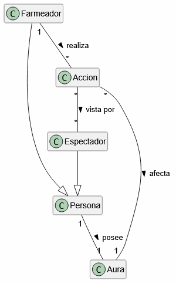

# Farmear aura

## 1. Diagrama de Clases

## Justificación de la Cardinalidad

* **`Persona "1" -- "1" Aura`**: Relación estricta de uno a uno. Toda persona que participa en esta dinámica posee exactamente un único medidor de aura asociado a su identidad. Conceptualmente, no es posible tener cero auras ni múltiples auras paralelas; es un estatus inherente al sujeto.
* **`Farmeador "1" -- "*" Accion`**: Un farmeador (1) realiza una o múltiples acciones (`1..*`). La decisión de requerir un mínimo de 1 radica en la definición del rol: si un sujeto no ejecuta al menos una acción deliberada, no asume el rol de `Farmeador` dentro de este escenario, quedándose simplemente como una `Persona` base o un `Espectador`.
* **`Accion "*" -- "*" Espectador`**: Muchas acciones (`*`) pueden ser vistas por uno o muchos espectadores (`1..*`). El límite inferior de `1` en el lado del espectador es la regla fundamental de este dominio: si una acción se realiza en el vacío (0 espectadores), no genera impacto social y no es susceptible de evaluación. Requiere obligatoriamente un público mínimo para existir como evento de farmeo.
* **`Accion "*" -- "1" Aura`**: Múltiples acciones ejecutadas a lo largo del tiempo (`*`) convergen y terminan afectando siempre a un único (`1`) medidor de aura, correspondiente a la persona que ejecutó dichos actos.