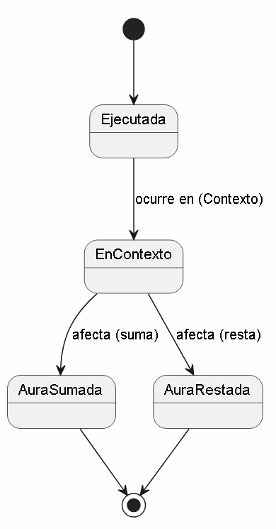

# Escenario 2: Farmear aura

## Diagrama de Dominio

## Glosario
* **Individuo:** La persona que interactúa socialmente y cuyo estatus está en juego.
* **Aura:** Una medida abstracta e intangible del carisma, respeto o "coolness" del individuo ante los demás.
* **AccionSocial:** Cualquier acto, comentario o comportamiento que el individuo realiza (ej. decir algo épico, o tropezarse en público).
* **Contexto:** El entorno físico o digital y los espectadores presentes. Una misma acción da o quita aura dependiendo de quién mire.

## Supuestos adoptados
* El "Aura" no es algo estático ni viene de nacimiento, es un valor dinámico que fluctúa (como la experiencia en un videojuego).
* Asumimos que para que haya un "farmeo" (o pérdida) de aura, la acción no ocurre en un vacío; requiere de un *Contexto* (otras personas o las redes sociales) que juzgue y valide el cambio de aura.
* "Farmear" implica realizar *Acciones Sociales* deliberadas con la intención de subir el medidor.

## Justificación de decisiones
* **¿Por qué añadir `Contexto`?**
  Farmear aura es un fenómeno puramente social. Caerse de las escaleras estando solo no te quita aura. Caerse frente a tu grupo de amigos sí. Por tanto, el *Contexto* es indispensable para que la *AccionSocial* tenga un efecto real sobre el *Aura*.

# Diagrama de Estados: Ciclo de Vida de una Acción Social (Farmear Aura)

## Diagrama de Estados (Versión Inicial)

## Justificación de Decisiones (Versión Base Iterativa)

Este diagrama de estados representa una primera aproximación al ciclo de vida de la entidad `AccionSocial`, modelado estrictamente a partir de las relaciones establecidas el diagrama de clases inicial. Se diseñó como una versión base.

Las decisiones de modelado actuales se justifican de la siguiente manera:

* **Enfoque en la `AccionSocial`:** Se ha elegido modelar el estado de la acción (y no del individuo o del aura) porque es la entidad que actúa como motor de cambio en el sistema. Es la acción la que nace, es evaluada y finalmente muere tras causar un impacto.
* **Estado `Ejecutada`:** Representa el momento exacto en que el `Individuo` realiza el acto. Es el punto de entrada al sistema, reflejando la relación "Ejecuta" del modelo de dominio.
* **Transición a `EnContexto`:** Refleja la necesidad absoluta de un entorno o público ("Ocurre en"). Una acción no tiene valor intrínseco de "aura" hasta que es expuesta a un `Contexto` que la percibe.
* **Bifurcación Final (`AuraSumada` / `AuraRestada`):** Basado en la relación "Afecta (suma/resta)", el estado final de la acción depende del juicio del contexto. Esta separación imita flujos de validación estándar (como una solicitud "Aprobada" o "Rechazada") y marca el fin del ciclo de vida de la acción una vez que el atributo `Aura` del individuo ha sido actualizado.